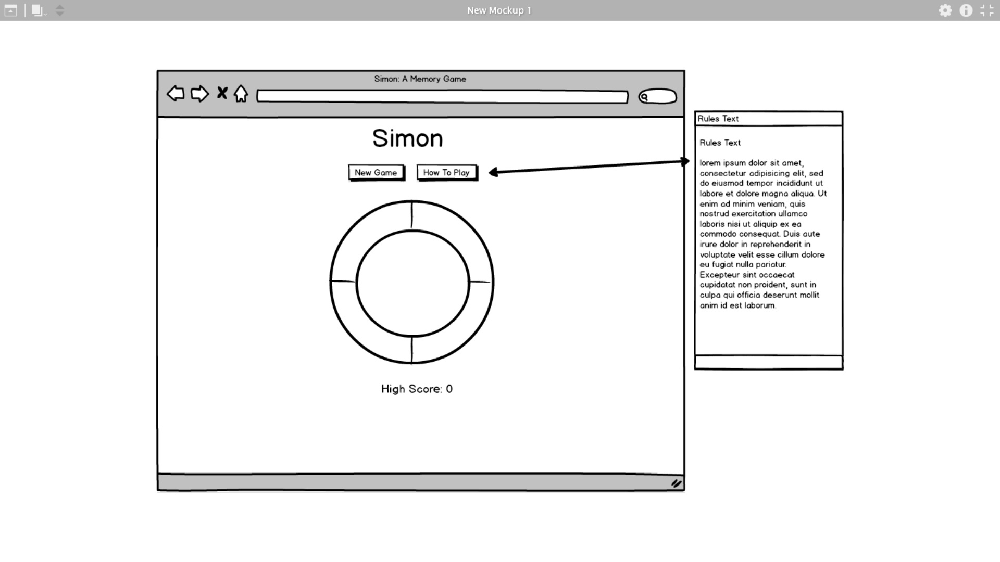
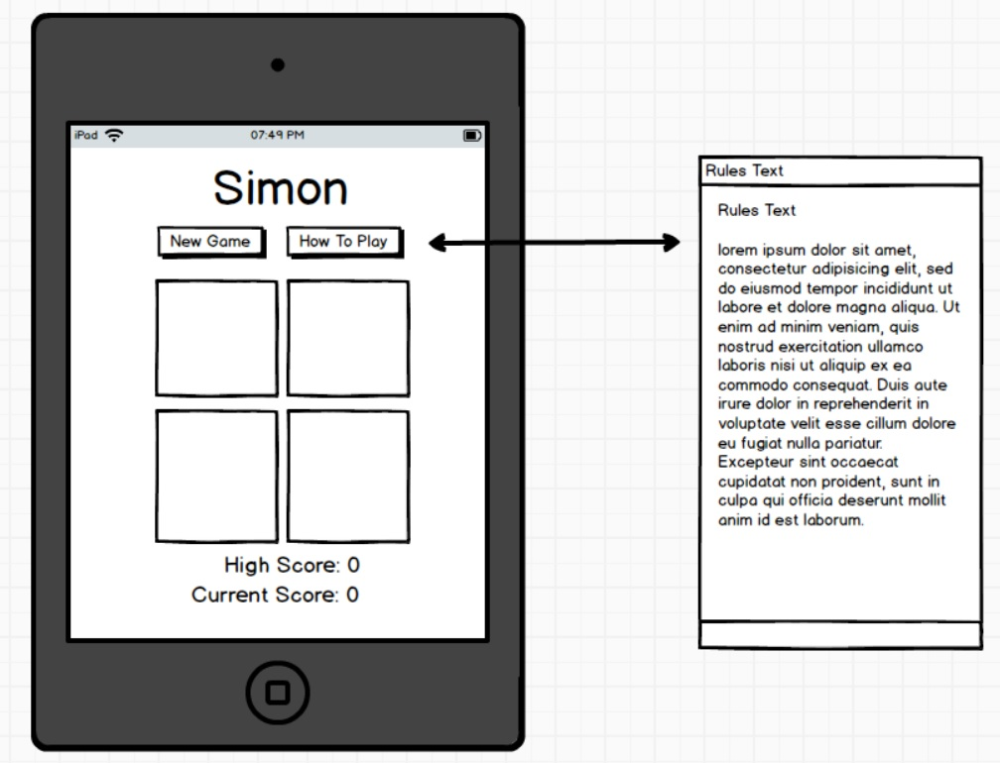
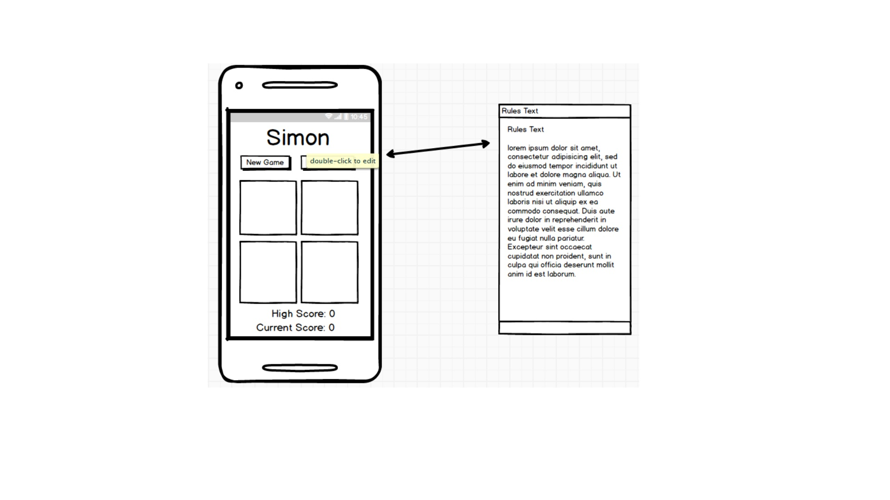

# Interactive Front End Project

This project is an impementation of the game 'Simon' using HTML, CSS and Javascript. The goal was to make a site that a user can interact with, as opposed to a static website.

'Simon' itself is a memory game. The idea is that the game will display a random light which the user has to click/tap on. Each time they do, the light sequence gets longer by one, and thus harder to memorise. The game ends when a user clicks/taps on the wrong light.

This is the second project as part of my [Code Institute](https://codeinstitute.net/) online diploma course.

---

## User Experience Design

### User Stories

These are potential actions that users of the website would want to perform. 

* As a user, I want to play the game, so I can experience it.
* As a user, I want to know how to play the game, so I understand it.
* As a user, I want to know how well I am doing so I can compare my scores.

---

### Wireframes

---

## Features

### Existing Features

* New game button, which starts a brand new game, interrupting the previous one if it exists.
* How to Play button, which displays a popup modal explaining the rules of the game.
* The game buttons, displayed on the page and required to play the game; which are only enabled when the user is allowed to press them.

### Features Left to Implement

* Could add permanent high score table which is persistent across different sessions.
* Could allow user to enter their name, which is entered on the high score table.
* Could allow user to select a difficulty, which affects how quickly the lights display.
* Could add sounds that play when game buttons are pressed

---

## Technologies Used

* [Javascript](https://www.javascript.com/) - Provides the means for the user to interact with the page via the buttons.

* [HTML](https://developer.mozilla.org/en-US/docs/Web/Guide/HTML/HTML5) - Provides the basic structure needed for the website to function.
    
* [CSS](https://developer.mozilla.org/en-US/docs/Web/CSS/CSS3) - Allows the basic website to be styled, making it more user friendly.

* [Bootstrap](https://getbootstrap.com/) - Allows for special structure in the website to make it as responsive as possible.

* [Google Fonts](https://fonts.google.com/) - Provides a specialised font.

---

## Testing

### User Stories Revisited

I have to check to see if the user stories from the design section can be met by users of the site.

* As a user, I want to play the game, so I can experience it.

  - Clicking the 'New Game' button will allow the user to play the game.

* As a user, I want to know how to play the game, so I understand it.

  - The 'How To play' button, when clicked, explains the rules of the game. The user can click anywhere outside of it to make the popup go away.

* As a user, I want to know how well I am doing so I can compare my scores.

  - The highest score obtained so far can be easily seen at the bottom of the screen.

### Game Logic

This is to see if the game itself is behaving in the manner it is intended to.

* When user input is allowed, button should change colour when pressed, and change back when released.
	- Tested by pressing each button when allowed to. Buttons behave as they should.
* Game should display sequence of lights at start of new game/new round.
	- Tested by playing the game. Lights display as intended.
* When user correctly presses buttons in a sequence, game should progress to next round
	- Tested by playing the game. Sequences are identified correctly when matched.
* Game should not allow user input until light sequence is finished displaying
	- Tested by clicking on the simon buttons while the light sequence is displaying. No response.
* Game should not allow new game to be started until light sequence is finished displaying.
	- Tested by clicking on the new game button while the lights are displaying. Button is greyed out, no response.
* Game should keep going indefinitely
	- Tested by playing the game as far as a sequence of 10. Assume that the game will continue after that point.
* Current score should update at the end of a round
	- Tested by playing the game. Can see current score changing as user progresses.
* Current score should reset when new game pressed
	- Tested by starting a new game after game already played. Current score displays zero.
* Game should display a game over message
	- Tested by getting a sequence wrong. Message displays on screen.
* Game should display high score message when one is achieved.
	- Tested by getting a higher score than the one displayed on the screen. Additional message displayed when game is lost.
* Both game over and high score messages should disappear when starting a new round.
	- Tested by playing & losing one game, then clicking new game. Messages disappear as expected.
* High score should update when a game ends
	- Tested by getting a higher score than the one displayed on the screen. Score updates accordingly when a game is lost.
* Touch screen should work as well as mouse based input.
	- Tested by using a touch screen device to perform any of the above tests. Results obtained are the same.

### Responsiveness

Using bootstrap to build the site allows most of it to be responsive automatically.

There are media queries in use to make sure larger fonts get used on larger screens, thus making the text easier to see.

The game board and buttons are coded using percentages so that they can fit on smaller screens proportionately. Beyond a certain limit, the game board stops growing in size starts using pixel widths. This is so that the board doesn't become too big and unwieldy on larger screens and makes it more user friendly.

I also used [Responsinator](https://www.responsinator.com/) to quickly see how the pages looked on varous devices.

### Validity

I used W3C [HTML Validator](https://validator.w3.org/) and [CSS Validator](http://jigsaw.w3.org/css-validator/) to check if my code was syntactically correct.

Also used Chrome Devtools 'audit' function to check pages for any outstanding issues. 

### Known Issues

The game does not function correctly on devices with both mouse-based and touch based input. The game assumes that one of the two will be used, not both. It will disable one of those input methods on such devices and will not re-enable it.

The game uses a timer to determine when the simon buttons are allowed to be pressed. This is the same length as the timer used to display the lights. There should be a very small margin of error between these two timers, but it is possible that the longer the game goes, the larger the error; and the more likely the buttons should allow input when they shouldn't. This is only in the case of extremely long games.

---

## Deployment

The code was deployed to GitHub Pages for web hosting. This involved:

1. Logging into my GitHub account
2. Opening the code for the project
3. Going to the 'Settings' tab
4. Scrolling to the Github Pages section
5. Selecting the 'master branch' from the 'source' section.

The live website can be found at [this URL](https://seakonn.github.io/milestone-two/index.html)

---

## Credits

### Code

* Code for lightsLoop function copied and modified from https://scottiestech.info/2014/07/01/javascript-fun-looping-with-a-delay/ 
* Various code snippets obtained from https://www.w3schools.com/